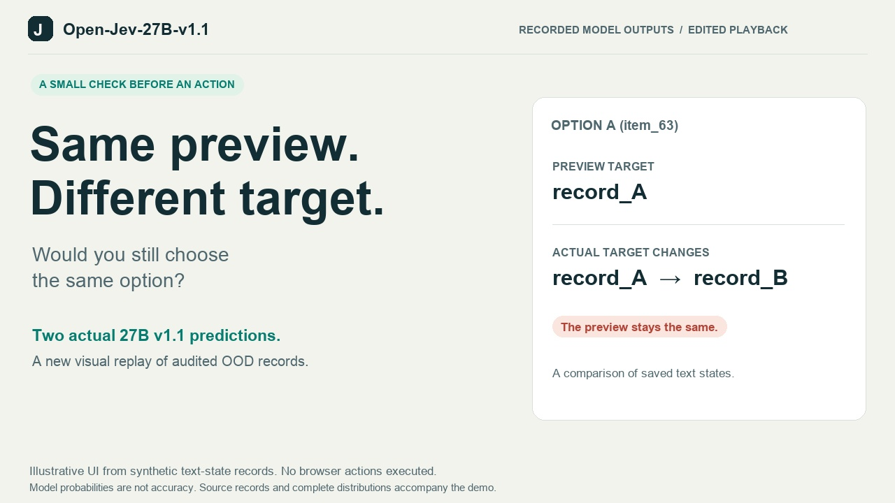

# Open-Jev

**Open-Jev-27B-v1.1 is here. Give your app a decision, with probabilities.**
Supply a context, questions and candidates; get typed probabilities directly,
without autoregressive answer generation or parsing generated JSON.

### Same preview. Different target.

[](https://zefan-cai.github.io/open-jev/v1-1/)

**[Watch the 32-second demo and try the interactive replay →](https://zefan-cai.github.io/open-jev/v1-1/)**

On X: [new 27B v1.1 video](https://x.com/Zefan_Cai/status/2102682845915619333) ·
[benchmark chart](https://x.com/Zefan_Cai/status/2102682231143911911) ·
[poster and release links](https://x.com/Zefan_Cai/status/2102683479586861302).

Two confirmation-gate cases. A misleading preview. Seven possible decisions.
Inspect how Open-Jev-27B-v1.1 ranks them, then compare the saved probabilities
when the actual target changes. The video replays real model outputs from
synthetic held-out cases; it is edited playback, with no browser actions executed.
Candidate order also differs between the original cases, so this is not a
controlled single-variable experiment.

**Build with it:** [Model](https://huggingface.co/ZefanCai/Open-Jev-27B-v1.1) ·
[Public dataset](https://huggingface.co/datasets/ZefanCai/Open-Jev-v1.1) ·
[Demo video](https://zefan-cai.github.io/open-jev/v1-1/replay.mp4) ·
[Poster](https://zefan-cai.github.io/open-jev/v1-1/poster.png) ·
[Replay evidence](release/demos/v1.1-confirmation-gate-20260923/README.md)

**Project website:** [zefan-cai.github.io/open-jev](https://zefan-cai.github.io/open-jev/) — demos, measured results and project background.

**Hugging Face:** [Collection](https://huggingface.co/collections/ZefanCai/open-jev) ·
[2B model](https://huggingface.co/ZefanCai/Open-Jev-2B) ·
[9B model](https://huggingface.co/ZefanCai/Open-Jev-9B) ·
[27B v1.1 model](https://huggingface.co/ZefanCai/Open-Jev-27B-v1.1) ·
[v1.1 dataset](https://huggingface.co/datasets/ZefanCai/Open-Jev-v1.1) ·
[Original dataset](https://huggingface.co/datasets/ZefanCai/Open-Jev)

**Try it online:** [Text & CSV workbench](https://zefan-cai.github.io/open-jev/workbench/) · [Open in Hugging Face](https://huggingface.co/spaces/ZefanCai/Open-Jev-Workbench)

**No-code workbench:** [User guide](docs/get-started.md) · [Workbench source](examples/workbench/) · [CPU deployment](deploy/huggingface-space/). Paste messages or import a CSV, define your categories, and download the original table with suggested labels and candidate probabilities. The hosted workbench uses the released Open-Jev-2B model on CPU. Start with a few rows: this trial is slower than the GPU deployment measured below. Its optional walkthrough is explicitly marked as an illustrative example.

**Benchmarks:** [Results and scope](docs/benchmarks.md) ·
[Website tables](https://zefan-cai.github.io/open-jev/benchmarks/) ·
[Source code](https://github.com/Zefan-Cai/Open-Jev)

**New game arcade:** [Snake, tic-tac-toe, Box Runner and Tile Platformer](https://zefan-cai.github.io/open-jev/games/). Pick an action, then reveal the real Open-Jev-27B-v1.1 probabilities for 16 saved game states. Three model/reference disagreements are retained. These are independent recorded decision snapshots, not a live gameplay rollout.

**Open-Jev 27B v1.1:** the complete 127,787-row internal evaluation passed independent audit, with zero failed, missing or duplicate predictions. The [four-panel report](docs/internal-full-evaluation.md) preserves the Open-Jev-2B and Open-Jev-9B results and compares the new 27B checkpoint on both the original and expanded holdouts. Its separate JevBench result is **197/231 (85.28%)**, including **80/111 Hard (72.07%)**; Jev remains ahead by three overall and one Hard answer.

All three model packages contain LoRA adapters, a trained scalar decision head and saved calibration temperature. The 27B v1.1 package uses LoRA rank 8. They require pinned upstream Qwen weights and the Open-Jev loader; base weights are not included. The hosted workbench continues to use the original Open-Jev-2B model.

Open-Jev is an independent implementation inspired by TypeSafe's Jev. It does
not reproduce proprietary RLCD, private weights or training data, and does not
claim TypeSafe's advertised speedups or parity with every community demo.

Current results: [methods and quality](docs/provider-comparison.md) ·
[interactive comparison](https://zefan-cai.github.io/open-jev/#comparison) ·
[published X thread](https://x.com/Zefan_Cai/status/2101845509170417784) ·
[community cases and benchmark plan](docs/community-research-20260921.md).

**New external evaluation:** the [audited JevBench public-subset report](docs/jevbench-public.md)
compares 27B v1.1, the Open-Jev-2B and Open-Jev-9B baselines, Jev, GPT-5.6 Luna and GPT-6 Astra on all
231 available public tasks. This is the public subset of 534 tasks; no full-534 score is claimed. It includes every decision, per-tier results,
probability validation and timing diagnostics, with candidate-order and
hardware/network limitations. See the [dedicated website table](https://zefan-cai.github.io/open-jev/#jevbench).

**Broader data iteration:** [new community cases](docs/community-research-broadening-20260921.md), [the frozen 148,639-row training mixture](docs/community-hard-training-v2.md), and the [project story](https://zefan-cai.github.io/open-jev/story/) document the sources, construction, controls and limitations. The audited 27B results appear below; changes in model scale, prior training and data prevent attributing the difference to new data alone.

**Consumer GPUs:** [running the 9B in bf16 on one 16 GB card](docs/consumer-gpu.md), with JevBench results on an RTX 4060 Ti, an RTX 5060 Ti and an H100, and the opt-in options that make the cached path faster.

**V3 data prepared:** [natural intent routing](docs/community-routing-v3.md),
[executable SQL](docs/sql-semantics-v3.md) and [approval/CMS controls](docs/community-workflow-v3.md)
add 129,288 decision rows, including 74,921 training rows. The frozen next-stage
mixture combines those training rows with 21,928 earlier replay rows for 96,849
training rows. The data are staged and tokenizer-checked; this prepared next stage has no completed model result.
The [training recipe](docs/community-hard-training-v3.md) and
[internal evaluation guide](docs/internal-evaluation.md) explain held-out splits,
the fixed 1,280-row / 840-group comparison panel and equal-group reporting.
These V3 figures describe prepared data, separate from the audited v1.1 results below.


[Demo provenance and reproduction](docs/website-and-videos.md) · [Source inventory](docs/public-capabilities.md) · [Published introduction and demo videos](release/social/README.md).

The [27B v1.1 full internal audit](reports/new27b-internal-full-20260923/report.json) covers every expanded Test/OOD row. The Open-Jev-2B and Open-Jev-9B checkpoints retain their [original full-data audit](reports/full-data-eval-n1-v1/README.md): each trained on 80,816 release-v2 rows and was evaluated on all 26,452 original held-out rows. New 2B training stopped; new 9B training did not start. Neither has a v1.1 result.

| Model | Old Test | Old OOD | Expanded Test | Expanded OOD | JevBench public 231 | Hard 111 |
|---|---:|---:|---:|---:|---:|---:|
| Open-Jev-2B | 9,515 / 10,046 (94.71%) | 13,287 / 15,446 (86.02%) | Not evaluated | Not evaluated | 150 / 231 (64.94%) | 46 / 111 (41.44%) |
| Open-Jev-9B | 9,799 / 10,046 (97.54%) | 14,205 / 15,446 (91.97%) | Not evaluated | Not evaluated | 179 / 231 (77.49%) | 66 / 111 (59.46%) |
| Open-Jev-27B-v1.1 | 9,876 / 10,046 (98.31%) | 14,825 / 15,446 (95.98%) | 41,357 / 42,789 (96.65%) | 80,934 / 83,924 (96.44%) | 197 / 231 (85.28%) | 80 / 111 (72.07%) |

Old Test/OOD cover all 10,532 / 15,920 rows; Expanded Test/OOD cover all 43,301 / 84,486 rows. Internal cells show hard-correct / hard rows. Soft targets (486 / 474 / 512 / 562 rows, respectively) remain in probability metrics. The old panels are unchanged-content subsets of the expanded panels; they overlap and must not be added together.

No matching full-data base-model evaluation was run, so these figures do not isolate a training gain. The separate JevBench columns use a 16,384-token limit; internal evaluation uses 4,096 with no truncation and saved calibration. Separate [2B](reports/fullpass-2b-n1/README.md) and
[9B sampled-result audits](reports/fullpass-9b-n1/README.md) compare each trained
model with its own base on the same 512 test and 512 OOD selections. Wiki,
T-Rex, painting OOD and some customer-workflow judgments remain weak; all
subgroup results and calibration regressions are retained. Final-model JF100
and closed-loop task results remain pending.

The older 100-step pilots score **49.33% / 62.33% / 65.33%** on the
[16K JF100 evaluation](reports/pilot-frontier-n1-16k.md), with all 900 requests
valid. These are different checkpoints from the full-pass models above.
[Pilot workflow and game evaluations](reports/pilot-suite-n1-4k.md) retain the
failures: the learned policies collected no food in the sampled Snake episodes
and completed no platformer episodes.

## Inference latency

The [latency report](docs/inference-latency.md) measures the Open-Jev-2B
checkpoint with warmed in-process Predictor calls and real loopback HTTP
requests. It records P50/P95, context and candidate counts, hardware, cache
mode, all warmup/timed attempts, and cache-output parity. The
[website latency table and evidence video](https://zefan-cai.github.io/open-jev/#latency)
use those saved measurements; video playback duration is not inference time.

The same 11 saved workloads were measured against **Jev-1.13.0** from the same
client: 220 measured HTTPS requests and 33 warmups, with no request errors.
For customer service, median local Open-Jev HTTP latency is **85.03 ms** versus
**295.26 ms** for Jev HTTPS. At 1024 state tokens and 32 candidates, Open-Jev is
slower: **1015.90 ms** versus **301.37 ms**. Hardware and network paths differ;
this is observed deployment latency, not matched-hardware speedup. CUDA prefix
caching exceeded the probability tolerance on 9/11 workloads; all selected
decisions matched, and caching remains off by default. Full results, including unfavorable cases, are in the
[public evidence](reports/inference-latency/public).

The [provider comparison](docs/provider-comparison.md) also evaluates OpenAI
structured decisions on identical saved requests and maintains a separate
all-domain quality suite. Latency does not establish equal task quality.
For the same customer-service request, OpenAI Luna and Astra have P50 response
times of **918.13 ms** and **1938.39 ms**, respectively, with their recorded
reasoning settings and structured categorical outputs.

## Try it

Python 3.10+; model inference requires the training dependencies and a suitable GPU.
The GPU workflow and full test suite target Linux. The [N1 runtime record](docs/resources.md)
lists observed package versions and the remaining clean-install verification work.

```bash
git clone https://github.com/Zefan-Cai/Open-Jev.git
cd Open-Jev
python3 -m venv .venv
source .venv/bin/activate
python -m pip install -e '.[train]'
python -m unittest discover -s tests -v

# Start from the pinned upstream model; no Open-Jev checkpoint is required.
python -m jev.server --model Qwen/Qwen3.5-2B \
  --revision 15852e8c16360a2fea060d615a32b45270f8a8fc --max-length 4096
```

Open **http://127.0.0.1:8791** for the text/CSV workbench, **http://127.0.0.1:8791/examples/index.html** for the developer task lab, or **http://127.0.0.1:8791/examples/painting/index.html** for probability painting. Run from the checkout to include the example UI. The server binds to loopback by default and loads a real model; it does not substitute synthetic answers when inference fails.

Keep the server running. Run the client and service checks in another terminal
from the same checkout, with `source .venv/bin/activate`.

Trained 2B/9B adapters are published at the links above. Download a model
package or use a completed trained run, then replace the base-model launch
above with the following command and its final `checkpoint/` directory. A training-resume
snapshot is not an inference checkpoint.

```bash
python -m jev.server --checkpoint /path/to/run/checkpoint --max-length 4096
```

```python
from jev.client import Client

result = Client().ask(
    state="My order arrived damaged. Please refund it.",
    questions={
        "refund_requested": {"type": "noul", "instructions": "Is a refund explicitly requested?"},
        "route": {"type": "choice", "instructions": "Which team should handle this?",
                  "criteria": {"billing": "Refunds and charges", "engineering": "Software defects"}},
        "frustration": {"type": "score", "instructions": "Rate expressed frustration.",
                        "criteria": ["Calm", "Frustrated but civil", "Very angry"]},
    },
)
print(result["answers"])
```

## Run with Docker

[`Dockerfile`](Dockerfile) builds a self-contained 2B service. The published
checkpoint package and the pinned upstream base revision it requires are baked
into the image, so a started container loads the model and serves on port 8791
with no network access, no volumes and no download step.

```bash
docker compose up -d --build                  # NVIDIA GPU
docker compose up -d --build open-jev-cpu     # CPU only, much slower

curl -s -X POST http://127.0.0.1:8791/v1/systemone \
  -H 'Content-Type: application/json' \
  --data-binary @configs/example-request.json
```

The port is bound only after the checkpoint is loaded, so a healthy container is
a ready model. The build verifies each package file against the published
manifest and refuses a checkpoint whose recorded base revision differs from the
one being baked in. [`docker/README.md`](docker/README.md) documents the
settings, the CPU and 9B variants and the limits.


## Task coverage

| Area | Implemented here | Evidence boundary |
|---|---|---|
| Core API | Choice, Noul, Score; structured state; independent questions; dynamic candidates; bounded batching; calibration | Three original checkpoints reload and infer. Official `/v1/systemone` request/answer shape; partial API compatibility, not the full hosted service |
| Customer / security / agent traces / invoices | Four workflow forms, synthetic cases, action selection, authorization gates, raw and gated action-set evaluation | Simplified local policies; no external business actions executed |
| Games | Runnable Snake, T-Rex runner, Mario-style tile platformer, Wiki graph navigation, optional ViZDoom, tic-tac-toe; replay and baselines | Local game rules differ from original demos; original Mario/T-Rex state adapters also supplied |
| Painting | Palette, silhouette, binary RGB, HSL; browser demo; precise geometry training controls | Geometry data does not establish free-form artistic quality |
| Cookbooks | 15 request recipes for search/ranking, citations, RAG, guardrails, spans/dates, functions, skills, hierarchy, verification and features | Components and postprocessors; some full cookbook pipelines require external executors |
| Community controls | Browser DOM, RuneScape, Pokémon, HEIST, drone; 4/4/255/28-field stress examples | State/action adapters, not bundled emulators or complete browser/simulator agents |

Details: [workflows](docs/workflows.md), [games](docs/games.md), [painting](docs/painting.md), [recipes](docs/recipes.md), [community adapters](docs/community.md). Original launch data: [customer](docs/customer-case.md), [Doom](docs/doom-case.md), [Wiki](docs/wikiracing-case.md).

## Train and evaluate

[How multiple domains share one head](docs/multidomain-training.md) explains
candidate scoring, variable candidate sets, the actual mixture weights and
the limits of the current full-pass sampling.

[Jev Frontier 100](docs/frontier-eval.md) is a pinned external holdout: 100 items × 3 option rotations. Its questions/answers are excluded from training. Independent [reasoning controls](docs/reasoning-data.md) cover seven additional task domains.


The completed 2B/9B models use **release-v2: 115,821 records / 10,771 groups**,
including 80,816 training rows. This combines the original three demo families,
workflow controls, Snake/tic-tac-toe, runner/platformer controls, painting
geometry and independent reasoning controls. Rebuild commands, hashes and
limitations are tracked in the [data manifests](reports/data-manifests) and case
documents. Public official evaluation examples are not used to train this mix.

The broader prepared inventory now has **408,884 typed decision rows across
25 task-source identifiers**, counting the browser/drone expansion once and
adding ten separate citation, entity, amount, email, phone, context-retention,
sponsor-segment, silent-failure, retrieval and mailroom corpora. It contains
**268,493 train, 16,937 calibration, 15,532 validation, 33,183 test and 74,739 OOD
rows**. This separately prepared inventory is audited; the original Open-Jev-2B and Open-Jev-9B models have not
been retrained on it. These are decision rows, not independent
documents or episodes. JF100 remains a separate holdout. See the
[website inventory and video coverage](docs/website-and-videos.md).

The 27B v1.1 checkpoint trained on the frozen **328,672-row original mixture**, including **148,639 training rows**. Its [redistributable dataset projection](https://huggingface.co/datasets/ZefanCai/Open-Jev-v1.1) contains **326,619 rows / 147,139 training rows**, excluding 2,053 Wiki rows. The public projection is not the complete training or evaluation corpus. WANLI retains CC BY 4.0, original generated records use CC0, and TypeSafe short questions retain their documented source-license limitation.

The latest original community controls cover
[context retention](docs/context-retention-data.md),
[seven-way transcript categorization](docs/sponsor-segment-data.md), and
[silent API failures](docs/silent-failure-data.md). Their 30,234 rows passed
independent label and split audits. They do not change the active frozen
training mixture or the reported release-v2 accuracy.

The [graded retrieval controls](docs/ir-control-data.md) add 11,600 rows and
six executable reranking methods. The [multilingual mailroom controls](docs/mailroom-control-data.md)
add 114,800 rows with 11 question heads in English, Chinese and Turkish.
Fixed small provider probes remain separate from these full corpora and from
the external JF100 and TREC holdouts. [Provider comparisons](docs/provider-comparison.md)
report common-case quality, pending evaluations and real API costs alongside
the measured latency results. The five frozen API quality suites are complete for Jev,
Luna and Astra. JF100 reference matches are 232/300, 227/300 and 300/300,
respectively; see the comparison for other suites, equivalent game actions
and pending new Open-Jev inference. The two OpenAI runs total 1,616 quality
requests with zero request errors.

The separate [TREC-DL evaluation](reports/ir-control-v1/trec-holdout/README.md)
has completed Jev's 97 queries / 873 requests. DL19/DL20 nDCG@10 is
0.275836/0.190667 under strict validation and 0.728218/0.715734 in the
predeclared supplementary scalar analysis. Probability-mass failures affect
66 queries and remain zero in the strict metric. Luna also completed all 97
queries with strict nDCG@10 of 0.729911/0.702082, zero request errors and an
independently checked $0.799273 usage estimate. Astra also completed all 97
queries with strict nDCG@10 of 0.736610/0.714484, zero request errors and a
$39.62622 usage estimate. Open-Jev TREC results remain pending.

A separate [browser snapshot corpus](docs/browser-data.md) adds 21,980 supervised
records from 1,000 parent scenes, including 13,814 training records. It supplies
the browser portion of the expansion selected for fresh 27B training; completed
2B/9B runs used the unchanged release-v2 mixture.
The original pilots' [browser snapshot evaluation](reports/pilot-browser-n1/README.md)
matches the full reference proposal on 32/120, 69/120 and 104/120 cases for
2B/9B/27B (26.67%, 57.50%, 86.67%). The 2B result is below the
35/120 (29.17%) obtained by always returning BLOCKED on this sample; even 27B
chooses actions in 14 cases whose reference is BLOCKED.
Independent [drone snapshot controls](docs/drone-data.md) add 25,249 supervised
records, including 15,694 training records, from 500 parent scenes. These also
enter the new 27B expansion and have no flight or closed-loop results.
The original pilots' [drone snapshot evaluation](reports/pilot-drone-n1/README.md)
gets all three decisions correct on only 5/120, 14/120 and 21/120 cases for
2B/9B/27B. All three are below a post-hoc constant brake/risk-1/loss-false
reference of 29/120; valid interfaces do not establish useful drone control.
The [source follow-up](docs/source-coverage-followup-20260920.md) identifies
remaining citation, entity-alignment and extraction workflow gaps.
The selected [expansion mixture](docs/browser-drone-expansion.md) combines the
three frozen corpora: 163,050 records, including 110,324 training records.
It preserves their existing splits; the original release-v2 files remain frozen.
Its [complete input-length preflight](reports/preflight/browser-drone-expansion-v1/README.md)
passes at an explicit 4,096-token limit for all three models. The mixture has
3.801 times the training input tokens of release-v2; record counts alone
understate the added workload.

Run the commands below from the same **Git checkout**; training rejects a
wheel-only installation or source archive without `.git`. Before mixing data,
prepare `data/doom-basic-v1` and `data/wikiracing` using the
[Doom instructions](docs/doom-case.md) and [Wiki instructions](docs/wikiracing-case.md).
Those inputs are not created by the commands below.
The generation commands use the recorded per-corpus configurations. The final
400-step training command is a bounded example, not one of the completed
full-pass runs reported above.

```bash
python -m jev.case_customer --output-dir data/case-customer --groups 1000
python -m jev.case_workflows build --output-dir data/workflows-v1 --groups-per-workflow 250 --seed 42
python -m jev.game_cli build-data all --output-dir data/games-v1 --episodes 100 --max-steps 80 --seed 42
python -m jev.painting --output-dir data/painting-geometry-v1 --groups 60 --seed 42
python -m jev.game_cli build-control-data --output-dir data/control-games-v1 --episodes 100 --max-steps 40 --seed 42
python -m jev.mix_data --inputs data/case-customer data/doom-basic-v1 data/wikiracing \
  data/workflows-v1 data/painting-geometry-v1 data/games-v1 data/control-games-v1 --output-dir data/release-v1
python -m jev.case_reasoning --output-dir data/reasoning-control-v1 --groups 2500 --seed 76109
python -m jev.mix_data --inputs data/release-v1 data/reasoning-control-v1 --output-dir data/release-v2
python -m jev.train --model Qwen/Qwen3.5-2B \
  --revision 15852e8c16360a2fea060d615a32b45270f8a8fc \
  --data data/release-v2 --output runs/2b-expansion --steps 400 --train-rows 0 --max-length 4096 \
  --training-sampling shuffled --checkpoint-every 100
```

Training uses frozen source revisions, group-isolated splits, LoRA and a scalar decision head, soft cross-entropy + 0.1 Brier, and temperature fitted only on calibration data. The head starts from the pretrained Yes-minus-No readout. Each candidate is an independent sequence during training. Inference supports [request-local prefix caching](docs/prefix-caching.md): add `--prefix-cache` to prefill shared context/question tokens once, then branch only for candidate suffixes. Branches retain independent attention, convolution and recurrent states. The Open-Jev-2B BF16/CUDA comparison exceeded the probability tolerance on 9/11 workloads although all 440 paired selected decisions matched; caching remains experimental and off by default. Full 9B/27B comparisons remain pending. Large choices use bounded candidate batches and normalize only after all logits are reassembled.

The [four-card schedule](docs/four-gpu-handoff.md) and [early runtime evidence](reports/27b-ddp-n1/README.md) preserve historical training stages. The completed 27B v1.1 checkpoint is fixed at the predeclared 37,160-step stage; its full internal and public JevBench evaluations passed independent audits. Shared multi-GPU evaluation times are not single-GPU or HTTP/API latency measurements.

The offline [checkpoint packager](docs/checkpoint-package.md) prepares inference files, a model card, provenance, hashes and applicable licenses from a completed run. The released [2B](https://huggingface.co/ZefanCai/Open-Jev-2B), [9B](https://huggingface.co/ZefanCai/Open-Jev-9B) and [27B v1.1](https://huggingface.co/ZefanCai/Open-Jev-27B-v1.1) packages contain model components, not merged Qwen base weights. Historical [2B](reports/checkpoint-packages/2b-fullpass-v1/README.md) and [9B package metadata](reports/checkpoint-packages/9b-fullpass-v1/README.md) remain available.

The original pilot consumed **400 training records per model**, with only 128 test records across the three original task families. Customer/Doom metrics improved; Wiki OOD optimal-action accuracy regressed for 9B and 27B on 18 examples each. Do not treat that pilot as broad task competence.

Useful checks:

```bash
python -m scripts.check_demo_requests --output runs/demo-requests.jsonl
python -m scripts.evaluate_workflow_service --cases data/workflows-v1/workflow_cases.jsonl \
  --split test ood --per-workflow 12 --output-dir runs/workflow-eval
python -m jev.game_cli play snake --policy http --max-steps 100 --output runs/snake-model.json
python -m jev.game_cli replay runs/snake-model.json
python -m scripts.benchmark_api --request examples/community/support_28.json \
  --output runs/latency.json
```

The demo request check measures interface coverage, not semantic accuracy. Game traces distinguish learned policies, random policies and teacher/oracle policies. Workflow evaluation preserves raw errors separately from software authorization gates. The API batching benchmark measures serial versus fan-out requests. Separate [generation comparisons](docs/latency.md) report validity and latency on one small workload; neither comparison establishes a speedup over TypeSafe.

## License and provenance

Original code: [MIT](LICENSE). Independently generated controls: CC0-1.0 as marked in each manifest. The three pinned Qwen revisions were individually verified as Apache-2.0; see [model provenance](docs/model-provenance.md). Public datasets, optional engines and game assets retain their own licenses; see [third-party notes](THIRD_PARTY_NOTICES.md). No Nintendo ROM, Jev private dataset, service key or user account data is included. Do not use the development examples as a production authorization system.
